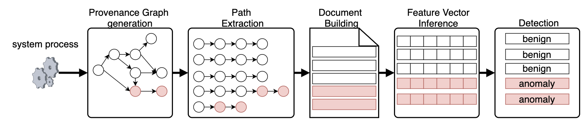
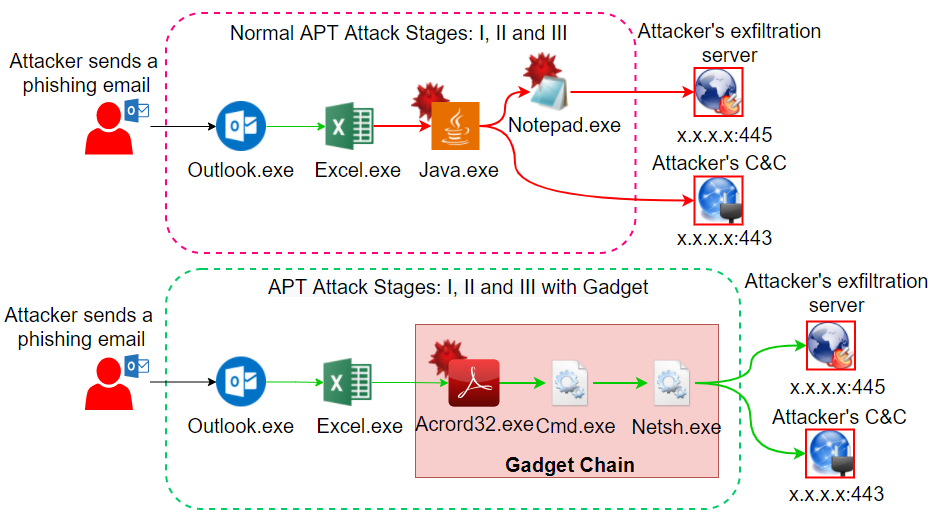
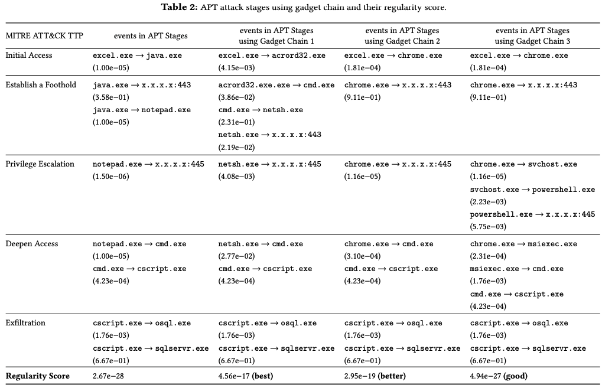
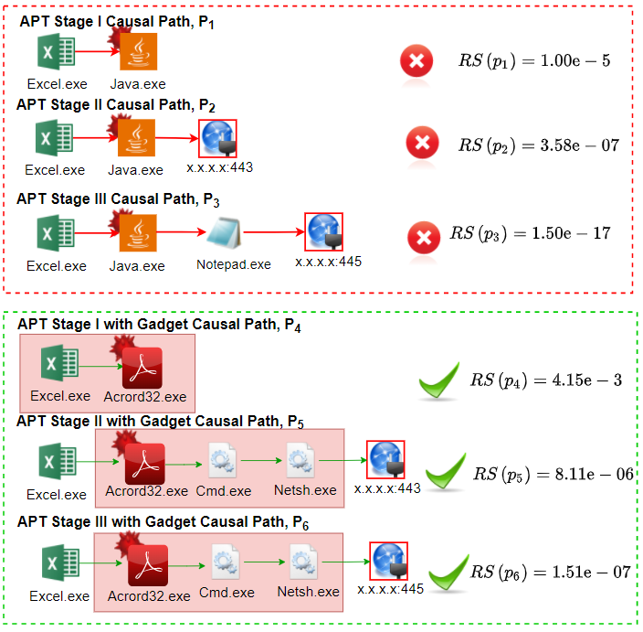
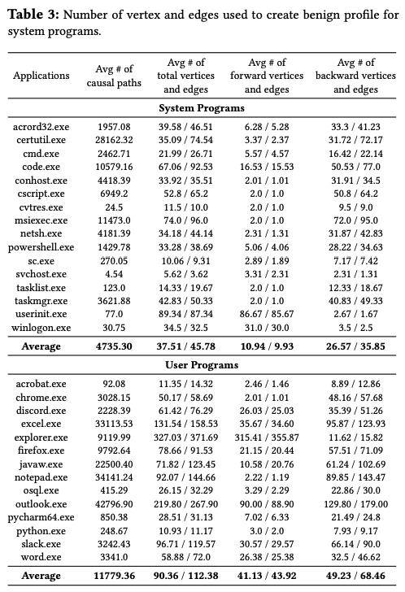
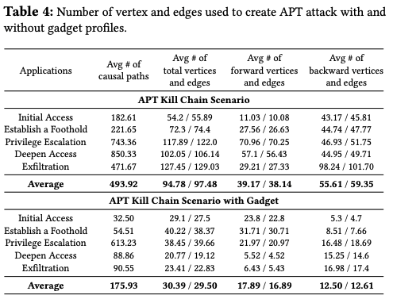
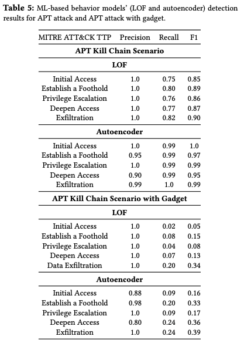
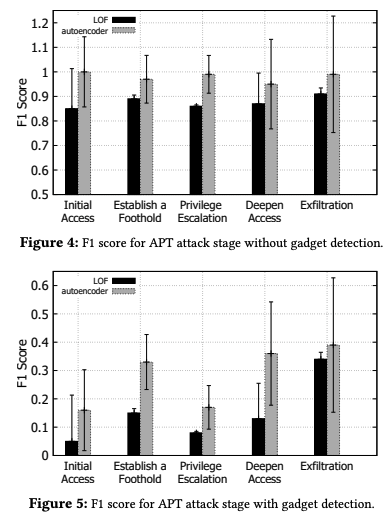

# AGE-GNN: Adversarial Generator using Graph Neural Network for ML Evasion

## Resource

- Paper:

- Dataset for training/testing/validation:

- Code: See [Doc2Vec](Doc2Vec), [AutoEncoder](AutoEncoder), [LOF](LOF), [Gadget](Gadget)

- Pre-trained Model:

## INTRODUCTION

Signature-based and network-based fail miserable against stealthy attacks such as zero-day vulnerability, malware mutants and advanced persistent threats (APTs) attacks. Simple machine Learning based detectors such as SVM, PCA, ensemble methods such as bagging/boosting and local outlier factor(LOF) have been used to detect these advanced threats but they have also been defeated by specifically crafted APTs. Current and on-going work has been using two prominent ML technique called Variational Auto Encoders(VAE) and Graph Neural Network(GNN) based anomaly detection

### ML BASED DETECTION FRAMEWORK


The Machine Learning framework for different models have different specifics but the overall framework is same. They first train a model with benign system activity and then uses it to classify system activities with the goal that system or user process that have been hijacked by malware(e.g., attacker) will show abnormal system activity that can be identified. It is clear that for attackers to cause harm or do their bidding, they will have to interact with system entities like files, network sockets and processes. These interaction or behavior would be different than the benign program’s normal behavior and this insights has motivated the latest ML based detection models.

## MOTIVATIONAL APT ATTACK STUDY


## APPROACH

### GADGET FINIDING & RANKING


### GADGET APT ATTACK CREATION


## DATASET

### Benign Dataset


### Malicious Dataset


## EVALUATION

### Detection Accuracy


### Degree of Evasiveness for APT Stages


# Citation

```
@Inproceedings{kunal2021,
author = {Mukherjee, Kunal},
title = {AGE-GNN: Adversarial Generator using Graph Neural Network for ML Evasion},
year = {2021},
isbn = {},
publisher = {Association for Computing Machinery},
address = {New York, NY, USA},
url = {},
doi = {},
booktitle = {Proceedings of the ACM/IEEE 43nd International Conference on Software Engineering},
pages = {},
numpages = {13},
keywords = {System Security, Variational AutoEncoders, Graph Neural Network,
Adversarial Example},
location = {},
series = {CCS '21}
}
```
