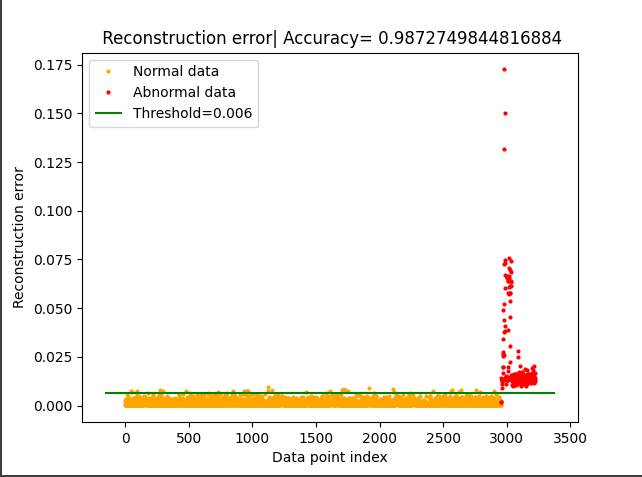
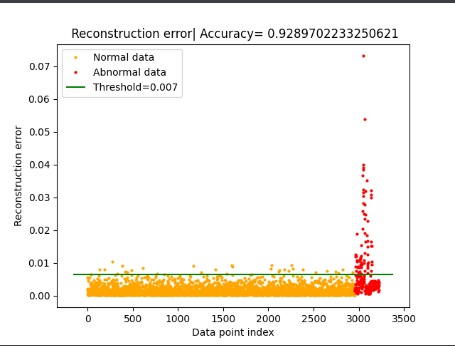

# Detection Result(Auto-Encoder)

### APT attack


### APT attack w/ gadget


# Gadget
```commandline
2021-11-15 01:09:11,607 | INFO	| ORG PATH: score: 0.9992283560460652: WINLOGON.EXE PROC_CREATE USERINIT.EXE PROC_CREATE EXPLORER.EXE PROC_CREATE OUTLOOK.EXE PROC_CREATE EXCEL.EXE PROC_CREATE JAVA.EXE PROC_CREATE NOTEPAD.EXE
2021-11-15 01:09:11,669 | INFO	| RARE EDGE: src:EXCEL.EXE:dst:JAVA.EXE:prob:0.0049468216670789
2021-11-15 01:09:11,678 | INFO	| RARE EDGE: src:JAVA.EXE:dst:NOTEPAD.EXE:prob:0.1626016260162601
2021-11-15 01:09:11,678 | INFO	| INTRO GADGET:['WINLOGON.EXE', 'USERINIT.EXE', 'EXPLORER.EXE', 'OUTLOOK.EXE', 'EXCEL.EXE'] PAYLOAD GADGET:['JAVA.EXE', 'NOTEPAD.EXE']
2021-11-15 01:09:11,685 | INFO	| TRYING TO FIND PATH FROM PAYLOAD GADGET EXCEL.EXE ->...-> ADOBE.EXE -> NOTEPAD.EXE: 1/2
2021-11-15 01:09:11,701 | INFO	| GADGET PATH: FOUND for RARE EDGE: src:EXCEL.EXE:dst:JAVA.EXE --> ['EXCEL.EXE', 'ADOBE.EXE']
2021-11-15 01:09:11,765 | INFO	| GADGET PATH: score: 0.5254389683301023: WINLOGON.EXE PROC_CREATE USERINIT.EXE PROC_CREATE EXPLORER.EXE PROC_CREATE OUTLOOK.EXE PROC_CREATE EXCEL.EXE PROC_CREATE ADOBE.EXE PROC_CREATE NOTEPAD.EXE
2021-11-15 01:09:11,765 | INFO	| TRYING TO FIND PATH FROM PAYLOAD GADGET EXCEL.EXE ->...-> TEST3.EXE -> NOTEPAD.EXE: 2/2
2021-11-15 01:09:11,798 | INFO	| GADGET PATH: FOUND for RARE EDGE: src:EXCEL.EXE:dst:JAVA.EXE --> ['EXCEL.EXE', 'TEST.EXE', 'TEST2.EXE', 'TEST3.EXE']
2021-11-15 01:09:11,911 | INFO	| GADGET PATH: score: 0.5254389683301023: WINLOGON.EXE PROC_CREATE USERINIT.EXE PROC_CREATE EXPLORER.EXE PROC_CREATE OUTLOOK.EXE PROC_CREATE EXCEL.EXE PROC_CREATE TEST.EXE PROC_CREATE TEST2.EXE PROC_CREATE TEST3.EXE PROC_CREATE NOTEPAD.EXE
2021-11-15 01:09:11,911 | INFO	| INTRO GADGET:['WINLOGON.EXE', 'USERINIT.EXE', 'EXPLORER.EXE', 'OUTLOOK.EXE', 'EXCEL.EXE', 'JAVA.EXE'] PAYLOAD GADGET:['NOTEPAD.EXE']
2021-11-15 01:09:11,928 | INFO	| TRYING TO FIND PATH FROM PAYLOAD GADGET JAVA.EXE ->...-> ADOBE.EXE -> NOTEPAD.EXE: 1/2
2021-11-15 01:09:12,022 | INFO	| GADGET PATH: NOT FOUND for RARE EDGE: src:JAVA.EXE:dst:NOTEPAD.EXE
2021-11-15 01:09:12,022 | INFO	| TRYING TO FIND PATH FROM PAYLOAD GADGET JAVA.EXE ->...-> TEST3.EXE -> NOTEPAD.EXE: 2/2
2021-11-15 01:09:12,107 | INFO	| GADGET PATH: NOT FOUND for RARE EDGE: src:JAVA.EXE:dst:NOTEPAD.EXE
```

# doc2vec
```commandline
2021-12-12 11:35:26,941 : INFO : Doc2Vec lifecycle event {'params': 'Doc2Vec(dm/m,d50,n5,w5,s0.001)', 'datetime': '2021-12-12T11:35:26.916634', 'gensim': '4.1.2', 'python': '3.9.7 (default, Sep 16 2021, 16:59:28) [MSC v.1916 64 bit (AMD64)]', 'platform': 'Windows-10-10.0.22000-SP0', 'event': 'created'}
2021-12-12 11:35:26,942 : INFO : collecting all words and their counts
2021-12-12 11:35:26,942 : INFO : PROGRESS: at example #0, processed 0 words (0/s), 0 word types, 0 tags
2021-12-12 11:35:27,013 : INFO : PROGRESS: at example #10000, processed 264958 words (3711447/s), 398 word types, 0 tags
2021-12-12 11:35:27,088 : INFO : PROGRESS: at example #20000, processed 475559 words (2831975/s), 454 word types, 0 tags
2021-12-12 11:35:27,133 : INFO : collected 454 word types and 28040 unique tags from a corpus of 28040 examples and 598295 words
2021-12-12 11:35:27,134 : INFO : Creating a fresh vocabulary
2021-12-12 11:35:27,137 : INFO : Doc2Vec lifecycle event {'msg': 'effective_min_count=1 retains 454 unique words (100.0%% of original 454, drops 0)', 'datetime': '2021-12-12T11:35:27.137115', 'gensim': '4.1.2', 'python': '3.9.7 (default, Sep 16 2021, 16:59:28) [MSC v.1916 64 bit (AMD64)]', 'platform': 'Windows-10-10.0.22000-SP0', 'event': 'prepare_vocab'}
2021-12-12 11:35:27,138 : INFO : Doc2Vec lifecycle event {'msg': 'effective_min_count=1 leaves 598295 word corpus (100.0%% of original 598295, drops 0)', 'datetime': '2021-12-12T11:35:27.138113', 'gensim': '4.1.2', 'python': '3.9.7 (default, Sep 16 2021, 16:59:28) [MSC v.1916 64 bit (AMD64)]', 'platform': 'Windows-10-10.0.22000-SP0', 'event': 'prepare_vocab'}
2021-12-12 11:35:27,142 : INFO : deleting the raw counts dictionary of 454 items
2021-12-12 11:35:27,142 : INFO : sample=0.001 downsamples 39 most-common words
2021-12-12 11:35:27,143 : INFO : Doc2Vec lifecycle event {'msg': 'downsampling leaves estimated 198322.54032296914 word corpus (33.1%% of prior 598295)', 'datetime': '2021-12-12T11:35:27.142638', 'gensim': '4.1.2', 'python': '3.9.7 (default, Sep 16 2021, 16:59:28) [MSC v.1916 64 bit (AMD64)]', 'platform': 'Windows-10-10.0.22000-SP0', 'event': 'prepare_vocab'}
2021-12-12 11:35:27,151 : INFO : estimated required memory for 454 words and 50 dimensions: 11624600 bytes
2021-12-12 11:35:27,151 : INFO : resetting layer weights
2021-12-12 11:35:27,163 : INFO : Doc2Vec lifecycle event {'msg': 'training model with 1 workers on 454 vocabulary and 50 features, using sg=0 hs=0 sample=0.001 negative=5 window=5 shrink_windows=True', 'datetime': '2021-12-12T11:35:27.163996', 'gensim': '4.1.2', 'python': '3.9.7 (default, Sep 16 2021, 16:59:28) [MSC v.1916 64 bit (AMD64)]', 'platform': 'Windows-10-10.0.22000-SP0', 'event': 'train'}
2021-12-12 11:35:28,193 : INFO : EPOCH 1 - PROGRESS: at 58.13% examples, 175758 words/s, in_qsize 1, out_qsize 0
2021-12-12 11:35:28,699 : INFO : worker thread finished; awaiting finish of 0 more threads
2021-12-12 11:35:28,699 : INFO : EPOCH - 1 : training on 598295 raw words (226451 effective words) took 1.5s, 147872 effective words/s
2021-12-12 11:35:29,702 : INFO : EPOCH 2 - PROGRESS: at 62.74% examples, 185039 words/s, in_qsize 1, out_qsize 0
2021-12-12 11:35:30,143 : INFO : worker thread finished; awaiting finish of 0 more threads
2021-12-12 11:35:30,143 : INFO : EPOCH - 2 : training on 598295 raw words (226141 effective words) took 1.4s, 156979 effective words/s
2021-12-12 11:35:31,165 : INFO : EPOCH 3 - PROGRESS: at 71.97% examples, 191383 words/s, in_qsize 1, out_qsize 0
2021-12-12 11:35:31,506 : INFO : worker thread finished; awaiting finish of 0 more threads
2021-12-12 11:35:31,506 : INFO : EPOCH - 3 : training on 598295 raw words (225900 effective words) took 1.4s, 166054 effective words/s
2021-12-12 11:35:32,524 : INFO : EPOCH 4 - PROGRESS: at 62.74% examples, 182515 words/s, in_qsize 2, out_qsize 0
2021-12-12 11:35:32,963 : INFO : worker thread finished; awaiting finish of 0 more threads
2021-12-12 11:35:32,963 : INFO : EPOCH - 4 : training on 598295 raw words (226421 effective words) took 1.5s, 155702 effective words/s
2021-12-12 11:35:33,991 : INFO : EPOCH 5 - PROGRESS: at 67.36% examples, 185809 words/s, in_qsize 1, out_qsize 0
2021-12-12 11:35:34,418 : INFO : worker thread finished; awaiting finish of 0 more threads
2021-12-12 11:35:34,418 : INFO : EPOCH - 5 : training on 598295 raw words (226222 effective words) took 1.4s, 156100 effective words/s
2021-12-12 11:35:35,434 : INFO : EPOCH 6 - PROGRESS: at 67.36% examples, 188483 words/s, in_qsize 1, out_qsize 0
2021-12-12 11:35:35,860 : INFO : worker thread finished; awaiting finish of 0 more threads
2021-12-12 11:35:35,860 : INFO : EPOCH - 6 : training on 598295 raw words (226106 effective words) took 1.4s, 157561 effective words/s
2021-12-12 11:35:36,902 : INFO : EPOCH 7 - PROGRESS: at 53.17% examples, 163755 words/s, in_qsize 2, out_qsize 0
2021-12-12 11:35:37,663 : INFO : worker thread finished; awaiting finish of 0 more threads
2021-12-12 11:35:37,665 : INFO : EPOCH - 7 : training on 598295 raw words (226543 effective words) took 1.8s, 125846 effective words/s
2021-12-12 11:35:38,683 : INFO : EPOCH 8 - PROGRESS: at 55.71% examples, 175084 words/s, in_qsize 1, out_qsize 0
2021-12-12 11:35:39,300 : INFO : worker thread finished; awaiting finish of 0 more threads
2021-12-12 11:35:39,300 : INFO : EPOCH - 8 : training on 598295 raw words (226260 effective words) took 1.6s, 138785 effective words/s
2021-12-12 11:35:40,310 : INFO : EPOCH 9 - PROGRESS: at 58.13% examples, 179255 words/s, in_qsize 1, out_qsize 0
2021-12-12 11:35:40,965 : INFO : worker thread finished; awaiting finish of 0 more threads
2021-12-12 11:35:40,966 : INFO : EPOCH - 9 : training on 598295 raw words (226390 effective words) took 1.7s, 136402 effective words/s
2021-12-12 11:35:41,980 : INFO : EPOCH 10 - PROGRESS: at 53.17% examples, 167796 words/s, in_qsize 2, out_qsize 0
2021-12-12 11:35:42,664 : INFO : worker thread finished; awaiting finish of 0 more threads
2021-12-12 11:35:42,664 : INFO : EPOCH - 10 : training on 598295 raw words (226605 effective words) took 1.7s, 133686 effective words/s
2021-12-12 11:35:43,722 : INFO : EPOCH 11 - PROGRESS: at 51.27% examples, 158324 words/s, in_qsize 2, out_qsize 0
2021-12-12 11:35:44,685 : INFO : worker thread finished; awaiting finish of 0 more threads
2021-12-12 11:35:44,686 : INFO : EPOCH - 11 : training on 598295 raw words (226482 effective words) took 2.0s, 112347 effective words/s
2021-12-12 11:35:45,692 : INFO : EPOCH 12 - PROGRESS: at 58.13% examples, 179220 words/s, in_qsize 2, out_qsize 0
2021-12-12 11:35:46,245 : INFO : worker thread finished; awaiting finish of 0 more threads
2021-12-12 11:35:46,245 : INFO : EPOCH - 12 : training on 598295 raw words (226291 effective words) took 1.6s, 145503 effective words/s
2021-12-12 11:35:47,252 : INFO : EPOCH 13 - PROGRESS: at 53.17% examples, 169204 words/s, in_qsize 2, out_qsize 0
2021-12-12 11:35:47,906 : INFO : worker thread finished; awaiting finish of 0 more threads
2021-12-12 11:35:47,906 : INFO : EPOCH - 13 : training on 598295 raw words (226408 effective words) took 1.7s, 136662 effective words/s
2021-12-12 11:35:48,929 : INFO : EPOCH 14 - PROGRESS: at 53.17% examples, 166265 words/s, in_qsize 1, out_qsize 0
2021-12-12 11:35:49,598 : INFO : worker thread finished; awaiting finish of 0 more threads
2021-12-12 11:35:49,599 : INFO : EPOCH - 14 : training on 598295 raw words (226201 effective words) took 1.7s, 133852 effective words/s
2021-12-12 11:35:50,606 : INFO : EPOCH 15 - PROGRESS: at 55.71% examples, 176772 words/s, in_qsize 1, out_qsize 0
2021-12-12 11:35:51,230 : INFO : worker thread finished; awaiting finish of 0 more threads
2021-12-12 11:35:51,230 : INFO : EPOCH - 15 : training on 598295 raw words (226481 effective words) took 1.6s, 139103 effective words/s
2021-12-12 11:35:52,251 : INFO : EPOCH 16 - PROGRESS: at 53.17% examples, 167264 words/s, in_qsize 2, out_qsize 0
2021-12-12 11:35:52,898 : INFO : worker thread finished; awaiting finish of 0 more threads
2021-12-12 11:35:52,898 : INFO : EPOCH - 16 : training on 598295 raw words (226726 effective words) took 1.7s, 136251 effective words/s
2021-12-12 11:35:53,922 : INFO : EPOCH 17 - PROGRESS: at 53.17% examples, 166305 words/s, in_qsize 2, out_qsize 0
2021-12-12 11:35:54,574 : INFO : worker thread finished; awaiting finish of 0 more threads
2021-12-12 11:35:54,574 : INFO : EPOCH - 17 : training on 598295 raw words (226579 effective words) took 1.7s, 135486 effective words/s
2021-12-12 11:35:55,594 : INFO : EPOCH 18 - PROGRESS: at 55.71% examples, 174709 words/s, in_qsize 1, out_qsize 0
2021-12-12 11:35:56,235 : INFO : worker thread finished; awaiting finish of 0 more threads
2021-12-12 11:35:56,235 : INFO : EPOCH - 18 : training on 598295 raw words (226664 effective words) took 1.7s, 136675 effective words/s
2021-12-12 11:35:57,242 : INFO : EPOCH 19 - PROGRESS: at 53.96% examples, 174157 words/s, in_qsize 1, out_qsize 0
2021-12-12 11:35:57,847 : INFO : worker thread finished; awaiting finish of 0 more threads
2021-12-12 11:35:57,847 : INFO : EPOCH - 19 : training on 598295 raw words (226632 effective words) took 1.6s, 141039 effective words/s
2021-12-12 11:35:58,885 : INFO : EPOCH 20 - PROGRESS: at 53.17% examples, 163886 words/s, in_qsize 2, out_qsize 0
2021-12-12 11:35:59,534 : INFO : worker thread finished; awaiting finish of 0 more threads
2021-12-12 11:35:59,534 : INFO : EPOCH - 20 : training on 598295 raw words (225842 effective words) took 1.7s, 134148 effective words/s
2021-12-12 11:36:00,549 : INFO : EPOCH 21 - PROGRESS: at 49.38% examples, 161738 words/s, in_qsize 1, out_qsize 0
2021-12-12 11:36:01,475 : INFO : worker thread finished; awaiting finish of 0 more threads
2021-12-12 11:36:01,476 : INFO : EPOCH - 21 : training on 598295 raw words (226581 effective words) took 1.9s, 116814 effective words/s
2021-12-12 11:36:02,493 : INFO : EPOCH 22 - PROGRESS: at 55.71% examples, 175171 words/s, in_qsize 2, out_qsize 0
2021-12-12 11:36:03,084 : INFO : worker thread finished; awaiting finish of 0 more threads
2021-12-12 11:36:03,084 : INFO : EPOCH - 22 : training on 598295 raw words (226406 effective words) took 1.6s, 141087 effective words/s
2021-12-12 11:36:04,102 : INFO : EPOCH 23 - PROGRESS: at 51.27% examples, 164167 words/s, in_qsize 2, out_qsize 0
2021-12-12 11:36:04,793 : INFO : worker thread finished; awaiting finish of 0 more threads
2021-12-12 11:36:04,793 : INFO : EPOCH - 23 : training on 598295 raw words (226393 effective words) took 1.7s, 132798 effective words/s
2021-12-12 11:36:05,802 : INFO : EPOCH 24 - PROGRESS: at 53.17% examples, 168858 words/s, in_qsize 2, out_qsize 0
2021-12-12 11:36:06,570 : INFO : worker thread finished; awaiting finish of 0 more threads
2021-12-12 11:36:06,570 : INFO : EPOCH - 24 : training on 598295 raw words (226550 effective words) took 1.8s, 127716 effective words/s
2021-12-12 11:36:07,605 : INFO : EPOCH 25 - PROGRESS: at 55.71% examples, 172069 words/s, in_qsize 1, out_qsize 0
2021-12-12 11:36:08,241 : INFO : worker thread finished; awaiting finish of 0 more threads
2021-12-12 11:36:08,241 : INFO : EPOCH - 25 : training on 598295 raw words (226372 effective words) took 1.7s, 135729 effective words/s
2021-12-12 11:36:09,262 : INFO : EPOCH 26 - PROGRESS: at 53.96% examples, 171595 words/s, in_qsize 1, out_qsize 0
2021-12-12 11:36:09,941 : INFO : worker thread finished; awaiting finish of 0 more threads
2021-12-12 11:36:09,942 : INFO : EPOCH - 26 : training on 598295 raw words (226616 effective words) took 1.7s, 133665 effective words/s
2021-12-12 11:36:10,947 : INFO : EPOCH 27 - PROGRESS: at 49.38% examples, 162862 words/s, in_qsize 1, out_qsize 0
2021-12-12 11:36:11,664 : INFO : worker thread finished; awaiting finish of 0 more threads
2021-12-12 11:36:11,664 : INFO : EPOCH - 27 : training on 598295 raw words (226330 effective words) took 1.7s, 131701 effective words/s
2021-12-12 11:36:12,672 : INFO : EPOCH 28 - PROGRESS: at 58.13% examples, 179436 words/s, in_qsize 1, out_qsize 0
2021-12-12 11:36:13,328 : INFO : worker thread finished; awaiting finish of 0 more threads
2021-12-12 11:36:13,329 : INFO : EPOCH - 28 : training on 598295 raw words (226168 effective words) took 1.7s, 136301 effective words/s
2021-12-12 11:36:14,361 : INFO : EPOCH 29 - PROGRESS: at 55.71% examples, 172675 words/s, in_qsize 2, out_qsize 0
2021-12-12 11:36:14,956 : INFO : worker thread finished; awaiting finish of 0 more threads
2021-12-12 11:36:14,956 : INFO : EPOCH - 29 : training on 598295 raw words (225987 effective words) took 1.6s, 139345 effective words/s
2021-12-12 11:36:15,965 : INFO : EPOCH 30 - PROGRESS: at 53.17% examples, 168781 words/s, in_qsize 1, out_qsize 0
2021-12-12 11:36:16,589 : INFO : worker thread finished; awaiting finish of 0 more threads
2021-12-12 11:36:16,589 : INFO : EPOCH - 30 : training on 598295 raw words (226405 effective words) took 1.6s, 138775 effective words/s
2021-12-12 11:36:17,596 : INFO : EPOCH 31 - PROGRESS: at 55.71% examples, 177358 words/s, in_qsize 1, out_qsize 0
2021-12-12 11:36:18,286 : INFO : worker thread finished; awaiting finish of 0 more threads
2021-12-12 11:36:18,286 : INFO : EPOCH - 31 : training on 598295 raw words (226655 effective words) took 1.7s, 133924 effective words/s
2021-12-12 11:36:19,293 : INFO : EPOCH 32 - PROGRESS: at 55.71% examples, 177307 words/s, in_qsize 2, out_qsize 0
2021-12-12 11:36:19,901 : INFO : worker thread finished; awaiting finish of 0 more threads
2021-12-12 11:36:19,901 : INFO : EPOCH - 32 : training on 598295 raw words (226292 effective words) took 1.6s, 140707 effective words/s
2021-12-12 11:36:20,910 : INFO : EPOCH 33 - PROGRESS: at 53.17% examples, 168558 words/s, in_qsize 1, out_qsize 0
2021-12-12 11:36:21,599 : INFO : worker thread finished; awaiting finish of 0 more threads
2021-12-12 11:36:21,599 : INFO : EPOCH - 33 : training on 598295 raw words (226454 effective words) took 1.7s, 133543 effective words/s
2021-12-12 11:36:22,612 : INFO : EPOCH 34 - PROGRESS: at 53.17% examples, 168409 words/s, in_qsize 2, out_qsize 0
2021-12-12 11:36:23,324 : INFO : worker thread finished; awaiting finish of 0 more threads
2021-12-12 11:36:23,324 : INFO : EPOCH - 34 : training on 598295 raw words (225909 effective words) took 1.7s, 131434 effective words/s
2021-12-12 11:36:24,361 : INFO : EPOCH 35 - PROGRESS: at 58.13% examples, 174549 words/s, in_qsize 1, out_qsize 0
2021-12-12 11:36:24,948 : INFO : worker thread finished; awaiting finish of 0 more threads
2021-12-12 11:36:24,948 : INFO : EPOCH - 35 : training on 598295 raw words (226558 effective words) took 1.6s, 139795 effective words/s
2021-12-12 11:36:25,971 : INFO : EPOCH 36 - PROGRESS: at 53.96% examples, 171687 words/s, in_qsize 2, out_qsize 0
2021-12-12 11:36:26,624 : INFO : worker thread finished; awaiting finish of 0 more threads
2021-12-12 11:36:26,624 : INFO : EPOCH - 36 : training on 598295 raw words (226144 effective words) took 1.7s, 135546 effective words/s
2021-12-12 11:36:27,650 : INFO : EPOCH 37 - PROGRESS: at 53.96% examples, 170662 words/s, in_qsize 2, out_qsize 0
2021-12-12 11:36:28,293 : INFO : worker thread finished; awaiting finish of 0 more threads
2021-12-12 11:36:28,293 : INFO : EPOCH - 37 : training on 598295 raw words (226419 effective words) took 1.7s, 135977 effective words/s
2021-12-12 11:36:29,320 : INFO : EPOCH 38 - PROGRESS: at 58.13% examples, 175571 words/s, in_qsize 1, out_qsize 0
2021-12-12 11:36:29,948 : INFO : worker thread finished; awaiting finish of 0 more threads
2021-12-12 11:36:29,948 : INFO : EPOCH - 38 : training on 598295 raw words (226340 effective words) took 1.7s, 136959 effective words/s
2021-12-12 11:36:30,960 : INFO : EPOCH 39 - PROGRESS: at 55.71% examples, 175617 words/s, in_qsize 1, out_qsize 0
2021-12-12 11:36:31,546 : INFO : worker thread finished; awaiting finish of 0 more threads
2021-12-12 11:36:31,546 : INFO : EPOCH - 39 : training on 598295 raw words (226295 effective words) took 1.6s, 141961 effective words/s
2021-12-12 11:36:32,565 : INFO : EPOCH 40 - PROGRESS: at 53.96% examples, 172158 words/s, in_qsize 1, out_qsize 0
2021-12-12 11:36:33,167 : INFO : worker thread finished; awaiting finish of 0 more threads
2021-12-12 11:36:33,167 : INFO : EPOCH - 40 : training on 598295 raw words (226785 effective words) took 1.6s, 140274 effective words/s
2021-12-12 11:36:34,173 : INFO : EPOCH 41 - PROGRESS: at 55.71% examples, 176860 words/s, in_qsize 2, out_qsize 0
2021-12-12 11:36:34,834 : INFO : worker thread finished; awaiting finish of 0 more threads
2021-12-12 11:36:34,834 : INFO : EPOCH - 41 : training on 598295 raw words (226301 effective words) took 1.7s, 136015 effective words/s
2021-12-12 11:36:35,865 : INFO : EPOCH 42 - PROGRESS: at 53.96% examples, 170052 words/s, in_qsize 1, out_qsize 0
2021-12-12 11:36:36,502 : INFO : worker thread finished; awaiting finish of 0 more threads
2021-12-12 11:36:36,502 : INFO : EPOCH - 42 : training on 598295 raw words (226373 effective words) took 1.7s, 135953 effective words/s
2021-12-12 11:36:37,520 : INFO : EPOCH 43 - PROGRESS: at 53.17% examples, 167694 words/s, in_qsize 1, out_qsize 0
2021-12-12 11:36:38,172 : INFO : worker thread finished; awaiting finish of 0 more threads
2021-12-12 11:36:38,173 : INFO : EPOCH - 43 : training on 598295 raw words (226397 effective words) took 1.7s, 135921 effective words/s
2021-12-12 11:36:39,212 : INFO : EPOCH 44 - PROGRESS: at 58.13% examples, 174028 words/s, in_qsize 1, out_qsize 0
2021-12-12 11:36:39,829 : INFO : worker thread finished; awaiting finish of 0 more threads
2021-12-12 11:36:39,829 : INFO : EPOCH - 44 : training on 598295 raw words (226163 effective words) took 1.7s, 136976 effective words/s
2021-12-12 11:36:40,845 : INFO : EPOCH 45 - PROGRESS: at 60.39% examples, 180873 words/s, in_qsize 1, out_qsize 0
2021-12-12 11:36:41,383 : INFO : worker thread finished; awaiting finish of 0 more threads
2021-12-12 11:36:41,383 : INFO : EPOCH - 45 : training on 598295 raw words (226400 effective words) took 1.5s, 146361 effective words/s
2021-12-12 11:36:42,422 : INFO : EPOCH 46 - PROGRESS: at 53.17% examples, 164112 words/s, in_qsize 2, out_qsize 0
2021-12-12 11:36:43,072 : INFO : worker thread finished; awaiting finish of 0 more threads
2021-12-12 11:36:43,072 : INFO : EPOCH - 46 : training on 598295 raw words (226842 effective words) took 1.7s, 134529 effective words/s
2021-12-12 11:36:44,083 : INFO : EPOCH 47 - PROGRESS: at 55.71% examples, 176320 words/s, in_qsize 1, out_qsize 0
2021-12-12 11:36:44,751 : INFO : worker thread finished; awaiting finish of 0 more threads
2021-12-12 11:36:44,751 : INFO : EPOCH - 47 : training on 598295 raw words (226609 effective words) took 1.7s, 135252 effective words/s
2021-12-12 11:36:45,778 : INFO : EPOCH 48 - PROGRESS: at 53.96% examples, 170723 words/s, in_qsize 2, out_qsize 0
2021-12-12 11:36:46,440 : INFO : worker thread finished; awaiting finish of 0 more threads
2021-12-12 11:36:46,441 : INFO : EPOCH - 48 : training on 598295 raw words (226143 effective words) took 1.7s, 134321 effective words/s
2021-12-12 11:36:47,454 : INFO : EPOCH 49 - PROGRESS: at 53.17% examples, 168256 words/s, in_qsize 1, out_qsize 0
2021-12-12 11:36:48,100 : INFO : worker thread finished; awaiting finish of 0 more threads
2021-12-12 11:36:48,100 : INFO : EPOCH - 49 : training on 598295 raw words (226440 effective words) took 1.7s, 136721 effective words/s
2021-12-12 11:36:49,108 : INFO : EPOCH 50 - PROGRESS: at 53.96% examples, 173990 words/s, in_qsize 2, out_qsize 0
2021-12-12 11:36:49,759 : INFO : worker thread finished; awaiting finish of 0 more threads
2021-12-12 11:36:49,760 : INFO : EPOCH - 50 : training on 598295 raw words (226369 effective words) took 1.7s, 136842 effective words/s
2021-12-12 11:36:49,760 : INFO : Doc2Vec lifecycle event {'msg': 'training on 29914750 raw words (11319041 effective words) took 82.6s, 137041 effective words/s', 'datetime': '2021-12-12T11:36:49.760573', 'gensim': '4.1.2', 'python': '3.9.7 (default, Sep 16 2021, 16:59:28) [MSC v.1916 64 bit (AMD64)]', 'platform': 'Windows-10-10.0.22000-SP0', 'event': 'train'}
2021-12-12 11:36:49,761 : INFO : Doc2Vec lifecycle event {'fname_or_handle': 'C:\\Users\\kunmu\\Documents\\Kunal\\gitlab\\autoencoder\\models\\doc2vec\\doc2vect.bin', 'separately': 'None', 'sep_limit': 10485760, 'ignore': frozenset(), 'datetime': '2021-12-12T11:36:49.761083', 'gensim': '4.1.2', 'python': '3.9.7 (default, Sep 16 2021, 16:59:28) [MSC v.1916 64 bit (AMD64)]', 'platform': 'Windows-10-10.0.22000-SP0', 'event': 'saving'}
2021-12-12 11:36:49,761 : INFO : not storing attribute cum_table
2021-12-12 11:36:49,771 : INFO : saved C:\Users\kunmu\Documents\Kunal\gitlab\autoencoder\models\doc2vec\doc2vect.bin
```

# LOF
```commandline
2021-12-12 11:41:05,500 | INFO	| benign path: C:\Users\kunmu\Documents\Kunal\prov-ng-proj\eval-result\data-backup\anomaly\benign-fv-attack.csv
2021-12-12 11:41:05,501 | INFO	| anomaly path: C:\Users\kunmu\Documents\Kunal\prov-ng-proj\eval-result\data-backup\anomaly\anomaly-fv-attack.csv
2021-12-12 11:41:05,501 | INFO	| gadget path: C:\Users\kunmu\Documents\Kunal\prov-ng-proj\eval-result\data-backup\gadget1-data-exfil\anomaly-gadget-fv.csv
2021-12-12 11:41:28,506 | INFO	| ret1: 0.9992956844666411 ret2: 0.793233082706767 ret3: 0.5335820895522388
2021-12-12 11:41:28,511 | INFO	| TP:211
2021-12-12 11:41:28,511 | INFO	| FP:0
2021-12-12 11:41:28,511 | INFO	| TN:0
2021-12-12 11:41:28,511 | INFO	| FN:55
2021-12-12 11:41:28,511 | INFO	| Accuracy:0.793233082706767
2021-12-12 11:41:28,511 | INFO	| Precision:1.0
2021-12-12 11:41:28,511 | INFO	| Recall:0.793233082706767
2021-12-12 11:41:28,511 | INFO	| F1:0.8846960167714885
2021-12-12 11:41:28,511 | INFO	| 


2021-12-12 11:41:28,512 | INFO	| TP:143
2021-12-12 11:41:28,513 | INFO	| FP:0
2021-12-12 11:41:28,513 | INFO	| TN:0
2021-12-12 11:41:28,513 | INFO	| FN:125
2021-12-12 11:41:28,513 | INFO	| Accuracy:0.5335820895522388
2021-12-12 11:41:28,513 | INFO	| Precision:1.0
2021-12-12 11:41:28,513 | INFO	| Recall:0.5335820895522388
2021-12-12 11:41:28,513 | INFO	| F1:0.6958637469586375
2021-12-12 11:41:28,513 | INFO	| 
```

# autoencoder apt
```commandline
DEBUG: Autoencoder init
DEBUG: AutoencoderUtils init
DEBUG: Autoencoder Running
DEBUG: Running Autoencoder And Generating Model
DEBUG: UNIQUE RUN NAME202112121122_anomaly_2021_11_11_anomaly-fv.csv
DEBUG: TRAIN FILEPATH:C:\Users\kunmu\Documents\Kunal\gitlab\autoencoder\data\benign\benign_WIN\benign-fv.csv
DEBUG: ANOMALY FILEPATH:C:\Users\kunmu\Documents\Kunal\gitlab\autoencoder\data\anomaly_2021_11_11\anomaly-fv.csv
DEBUG: MODEL FILEPATH:C:\Users\kunmu\Documents\Kunal\gitlab\autoencoder\models\autoencoder\202112121122_anomaly_2021_11_11_anomaly-fv.csv.h5
DEBUG: LOG FILEPATH:C:\Users\kunmu\Documents\Kunal\gitlab\autoencoder\logs\202112121122_anomaly_2021_11_11_anomaly-fv.csv.log
DEBUG: No MINST
DEBUG:x_train:18471
DEBUG:x_abnormal:266
DEBUG: Removing Outliers
DEBUG: Dataset Size:14776
DEBUG: Distance Cutoff Limit:0.7352135558488804
DEBUG: Length of Denoised Data11820
DEBUG: Removing Outliers
DEBUG: Dataset Size:3695
DEBUG: Distance Cutoff Limit:0.7373763253743282
DEBUG: Length of Denoised Data2956
DEBUG: Getting Autoencoder Model
2021-12-12 11:25:27.759098: I tensorflow/core/platform/cpu_feature_guard.cc:142] This TensorFlow binary is optimized with oneAPI Deep Neural Network Library (oneDNN) to use the following CPU instructions in performance-critical operations:  AVX AVX2
To enable them in other operations, rebuild TensorFlow with the appropriate compiler flags.
2021-12-12 11:25:29.910571: I tensorflow/core/common_runtime/gpu/gpu_device.cc:1510] Created device /job:localhost/replica:0/task:0/device:GPU:0 with 3495 MB memory:  -> device: 0, name: NVIDIA GeForce RTX 3060 Laptop GPU, pci bus id: 0000:01:00.0, compute capability: 8.6
2021-12-12 11:25:30.462097: I tensorflow/compiler/mlir/mlir_graph_optimization_pass.cc:185] None of the MLIR Optimization Passes are enabled (registered 2)
Epoch 1/100
2021-12-12 11:25:34.723374: I tensorflow/stream_executor/cuda/cuda_blas.cc:1760] TensorFloat-32 will be used for the matrix multiplication. This will only be logged once.
93/93 [==============================] - 5s 10ms/step - loss: 0.0058 - accuracy: 0.1878 - val_loss: 0.0036 - val_accuracy: 0.4344
Epoch 2/100
93/93 [==============================] - 1s 6ms/step - loss: 0.0031 - accuracy: 0.4457 - val_loss: 0.0027 - val_accuracy: 0.4645
Epoch 3/100
93/93 [==============================] - 1s 7ms/step - loss: 0.0025 - accuracy: 0.4658 - val_loss: 0.0023 - val_accuracy: 0.4861
Epoch 4/100
93/93 [==============================] - 1s 7ms/step - loss: 0.0022 - accuracy: 0.5067 - val_loss: 0.0021 - val_accuracy: 0.5284
Epoch 5/100
93/93 [==============================] - 1s 7ms/step - loss: 0.0020 - accuracy: 0.5380 - val_loss: 0.0020 - val_accuracy: 0.5457
Epoch 6/100
93/93 [==============================] - 1s 7ms/step - loss: 0.0019 - accuracy: 0.5487 - val_loss: 0.0019 - val_accuracy: 0.5470
Epoch 7/100
93/93 [==============================] - 1s 7ms/step - loss: 0.0018 - accuracy: 0.5506 - val_loss: 0.0018 - val_accuracy: 0.5477
Epoch 8/100
93/93 [==============================] - 1s 7ms/step - loss: 0.0018 - accuracy: 0.5510 - val_loss: 0.0018 - val_accuracy: 0.5494
Epoch 9/100
93/93 [==============================] - 1s 7ms/step - loss: 0.0017 - accuracy: 0.5514 - val_loss: 0.0017 - val_accuracy: 0.5538
Epoch 10/100
93/93 [==============================] - 1s 7ms/step - loss: 0.0017 - accuracy: 0.5538 - val_loss: 0.0017 - val_accuracy: 0.5548
Epoch 11/100
93/93 [==============================] - 1s 9ms/step - loss: 0.0017 - accuracy: 0.5552 - val_loss: 0.0017 - val_accuracy: 0.5541
Epoch 12/100
93/93 [==============================] - 1s 11ms/step - loss: 0.0017 - accuracy: 0.5563 - val_loss: 0.0017 - val_accuracy: 0.5545
Epoch 13/100
93/93 [==============================] - 1s 9ms/step - loss: 0.0016 - accuracy: 0.5591 - val_loss: 0.0016 - val_accuracy: 0.5592
Epoch 14/100
93/93 [==============================] - 1s 9ms/step - loss: 0.0016 - accuracy: 0.5583 - val_loss: 0.0016 - val_accuracy: 0.5585
Epoch 15/100
93/93 [==============================] - 1s 7ms/step - loss: 0.0016 - accuracy: 0.5591 - val_loss: 0.0016 - val_accuracy: 0.5585
Epoch 16/100
93/93 [==============================] - 1s 7ms/step - loss: 0.0016 - accuracy: 0.5589 - val_loss: 0.0016 - val_accuracy: 0.5592
Epoch 17/100
93/93 [==============================] - 1s 8ms/step - loss: 0.0016 - accuracy: 0.5607 - val_loss: 0.0016 - val_accuracy: 0.5619
Epoch 18/100
93/93 [==============================] - 1s 7ms/step - loss: 0.0016 - accuracy: 0.5597 - val_loss: 0.0016 - val_accuracy: 0.5656
Epoch 19/100
93/93 [==============================] - 1s 8ms/step - loss: 0.0016 - accuracy: 0.5606 - val_loss: 0.0016 - val_accuracy: 0.5653
Epoch 20/100
93/93 [==============================] - 1s 9ms/step - loss: 0.0016 - accuracy: 0.5577 - val_loss: 0.0016 - val_accuracy: 0.5622
Epoch 21/100
93/93 [==============================] - 1s 7ms/step - loss: 0.0016 - accuracy: 0.5603 - val_loss: 0.0016 - val_accuracy: 0.5677
Epoch 22/100
93/93 [==============================] - 1s 6ms/step - loss: 0.0016 - accuracy: 0.5628 - val_loss: 0.0016 - val_accuracy: 0.5643
Epoch 23/100
93/93 [==============================] - 2s 17ms/step - loss: 0.0016 - accuracy: 0.5618 - val_loss: 0.0016 - val_accuracy: 0.5619
Epoch 24/100
93/93 [==============================] - 1s 10ms/step - loss: 0.0016 - accuracy: 0.5618 - val_loss: 0.0016 - val_accuracy: 0.5612
Epoch 25/100
93/93 [==============================] - 1s 9ms/step - loss: 0.0016 - accuracy: 0.5633 - val_loss: 0.0016 - val_accuracy: 0.5694
Epoch 26/100
93/93 [==============================] - 1s 9ms/step - loss: 0.0015 - accuracy: 0.5613 - val_loss: 0.0016 - val_accuracy: 0.5690
Epoch 27/100
93/93 [==============================] - 1s 8ms/step - loss: 0.0015 - accuracy: 0.5617 - val_loss: 0.0016 - val_accuracy: 0.5680
Epoch 28/100
93/93 [==============================] - 1s 9ms/step - loss: 0.0015 - accuracy: 0.5649 - val_loss: 0.0016 - val_accuracy: 0.5687
Epoch 29/100
93/93 [==============================] - 1s 9ms/step - loss: 0.0015 - accuracy: 0.5640 - val_loss: 0.0016 - val_accuracy: 0.5724
Epoch 30/100
93/93 [==============================] - 1s 9ms/step - loss: 0.0015 - accuracy: 0.5646 - val_loss: 0.0016 - val_accuracy: 0.5636
Epoch 31/100
93/93 [==============================] - 1s 7ms/step - loss: 0.0015 - accuracy: 0.5636 - val_loss: 0.0016 - val_accuracy: 0.5673
Epoch 32/100
93/93 [==============================] - 1s 8ms/step - loss: 0.0015 - accuracy: 0.5646 - val_loss: 0.0016 - val_accuracy: 0.5687
Epoch 33/100
93/93 [==============================] - 1s 8ms/step - loss: 0.0015 - accuracy: 0.5657 - val_loss: 0.0016 - val_accuracy: 0.5710
Epoch 34/100
93/93 [==============================] - 1s 10ms/step - loss: 0.0015 - accuracy: 0.5640 - val_loss: 0.0015 - val_accuracy: 0.5690
Epoch 35/100
93/93 [==============================] - 1s 10ms/step - loss: 0.0015 - accuracy: 0.5643 - val_loss: 0.0016 - val_accuracy: 0.5677
Epoch 36/100
93/93 [==============================] - 1s 8ms/step - loss: 0.0015 - accuracy: 0.5657 - val_loss: 0.0015 - val_accuracy: 0.5707
Epoch 37/100
93/93 [==============================] - 1s 8ms/step - loss: 0.0015 - accuracy: 0.5673 - val_loss: 0.0015 - val_accuracy: 0.5734
Epoch 38/100
93/93 [==============================] - 1s 8ms/step - loss: 0.0015 - accuracy: 0.5646 - val_loss: 0.0015 - val_accuracy: 0.5700
Epoch 39/100
93/93 [==============================] - 1s 8ms/step - loss: 0.0015 - accuracy: 0.5654 - val_loss: 0.0015 - val_accuracy: 0.5707
Epoch 40/100
93/93 [==============================] - 1s 7ms/step - loss: 0.0015 - accuracy: 0.5650 - val_loss: 0.0015 - val_accuracy: 0.5697
Epoch 41/100
93/93 [==============================] - 1s 8ms/step - loss: 0.0015 - accuracy: 0.5667 - val_loss: 0.0015 - val_accuracy: 0.5707
Epoch 42/100
93/93 [==============================] - 1s 7ms/step - loss: 0.0015 - accuracy: 0.5698 - val_loss: 0.0015 - val_accuracy: 0.5656
Epoch 43/100
93/93 [==============================] - 1s 8ms/step - loss: 0.0015 - accuracy: 0.5666 - val_loss: 0.0015 - val_accuracy: 0.5704
Epoch 44/100
93/93 [==============================] - 1s 7ms/step - loss: 0.0015 - accuracy: 0.5668 - val_loss: 0.0015 - val_accuracy: 0.5724
Epoch 45/100
93/93 [==============================] - 1s 8ms/step - loss: 0.0015 - accuracy: 0.5685 - val_loss: 0.0015 - val_accuracy: 0.5673
Epoch 46/100
93/93 [==============================] - 1s 9ms/step - loss: 0.0015 - accuracy: 0.5646 - val_loss: 0.0015 - val_accuracy: 0.5697
Epoch 47/100
93/93 [==============================] - 1s 7ms/step - loss: 0.0015 - accuracy: 0.5673 - val_loss: 0.0015 - val_accuracy: 0.5717
Epoch 48/100
93/93 [==============================] - 1s 7ms/step - loss: 0.0015 - accuracy: 0.5662 - val_loss: 0.0015 - val_accuracy: 0.5714
Epoch 49/100
93/93 [==============================] - 1s 7ms/step - loss: 0.0015 - accuracy: 0.5668 - val_loss: 0.0015 - val_accuracy: 0.5697
Epoch 50/100
93/93 [==============================] - 1s 7ms/step - loss: 0.0015 - accuracy: 0.5686 - val_loss: 0.0015 - val_accuracy: 0.5683
Epoch 51/100
93/93 [==============================] - 1s 7ms/step - loss: 0.0015 - accuracy: 0.5668 - val_loss: 0.0015 - val_accuracy: 0.5704
Epoch 52/100
93/93 [==============================] - 1s 7ms/step - loss: 0.0015 - accuracy: 0.5669 - val_loss: 0.0015 - val_accuracy: 0.5704
Epoch 53/100
93/93 [==============================] - 1s 7ms/step - loss: 0.0015 - accuracy: 0.5683 - val_loss: 0.0015 - val_accuracy: 0.5643
Epoch 54/100
93/93 [==============================] - 1s 7ms/step - loss: 0.0015 - accuracy: 0.5676 - val_loss: 0.0015 - val_accuracy: 0.5653
Epoch 55/100
93/93 [==============================] - 1s 7ms/step - loss: 0.0015 - accuracy: 0.5664 - val_loss: 0.0015 - val_accuracy: 0.5697
Epoch 56/100
93/93 [==============================] - 1s 7ms/step - loss: 0.0015 - accuracy: 0.5684 - val_loss: 0.0015 - val_accuracy: 0.5643
Epoch 57/100
93/93 [==============================] - 1s 8ms/step - loss: 0.0015 - accuracy: 0.5671 - val_loss: 0.0015 - val_accuracy: 0.5690
Epoch 58/100
93/93 [==============================] - 1s 7ms/step - loss: 0.0015 - accuracy: 0.5688 - val_loss: 0.0015 - val_accuracy: 0.5704
Epoch 59/100
93/93 [==============================] - 1s 8ms/step - loss: 0.0015 - accuracy: 0.5674 - val_loss: 0.0015 - val_accuracy: 0.5700
Epoch 60/100
93/93 [==============================] - 1s 8ms/step - loss: 0.0015 - accuracy: 0.5657 - val_loss: 0.0015 - val_accuracy: 0.5694
Epoch 61/100
93/93 [==============================] - 1s 7ms/step - loss: 0.0015 - accuracy: 0.5666 - val_loss: 0.0015 - val_accuracy: 0.5660
Epoch 62/100
93/93 [==============================] - 1s 7ms/step - loss: 0.0015 - accuracy: 0.5699 - val_loss: 0.0015 - val_accuracy: 0.5700
Epoch 63/100
93/93 [==============================] - 1s 7ms/step - loss: 0.0015 - accuracy: 0.5675 - val_loss: 0.0015 - val_accuracy: 0.5724
Epoch 64/100
93/93 [==============================] - 1s 8ms/step - loss: 0.0015 - accuracy: 0.5670 - val_loss: 0.0015 - val_accuracy: 0.5731
Epoch 65/100
93/93 [==============================] - 1s 7ms/step - loss: 0.0015 - accuracy: 0.5657 - val_loss: 0.0015 - val_accuracy: 0.5731
Epoch 66/100
93/93 [==============================] - 1s 7ms/step - loss: 0.0015 - accuracy: 0.5668 - val_loss: 0.0015 - val_accuracy: 0.5663
Epoch 67/100
93/93 [==============================] - 1s 7ms/step - loss: 0.0015 - accuracy: 0.5668 - val_loss: 0.0015 - val_accuracy: 0.5744
Epoch 68/100
93/93 [==============================] - 1s 8ms/step - loss: 0.0015 - accuracy: 0.5654 - val_loss: 0.0015 - val_accuracy: 0.5694
Epoch 69/100
93/93 [==============================] - 1s 7ms/step - loss: 0.0015 - accuracy: 0.5686 - val_loss: 0.0015 - val_accuracy: 0.5714
Epoch 70/100
93/93 [==============================] - 1s 8ms/step - loss: 0.0015 - accuracy: 0.5627 - val_loss: 0.0015 - val_accuracy: 0.5670
Epoch 71/100
93/93 [==============================] - 1s 7ms/step - loss: 0.0015 - accuracy: 0.5648 - val_loss: 0.0015 - val_accuracy: 0.5670
Epoch 72/100
93/93 [==============================] - 1s 7ms/step - loss: 0.0015 - accuracy: 0.5663 - val_loss: 0.0015 - val_accuracy: 0.5694
Epoch 73/100
93/93 [==============================] - 1s 7ms/step - loss: 0.0015 - accuracy: 0.5668 - val_loss: 0.0015 - val_accuracy: 0.5653
Epoch 74/100
93/93 [==============================] - 1s 7ms/step - loss: 0.0015 - accuracy: 0.5664 - val_loss: 0.0015 - val_accuracy: 0.5683
Epoch 75/100
93/93 [==============================] - 1s 8ms/step - loss: 0.0015 - accuracy: 0.5657 - val_loss: 0.0015 - val_accuracy: 0.5700
Epoch 76/100
93/93 [==============================] - 1s 7ms/step - loss: 0.0015 - accuracy: 0.5668 - val_loss: 0.0015 - val_accuracy: 0.5707
Epoch 77/100
93/93 [==============================] - 1s 7ms/step - loss: 0.0015 - accuracy: 0.5663 - val_loss: 0.0015 - val_accuracy: 0.5650
Epoch 78/100
93/93 [==============================] - 1s 7ms/step - loss: 0.0015 - accuracy: 0.5643 - val_loss: 0.0015 - val_accuracy: 0.5734
Epoch 79/100
93/93 [==============================] - 1s 9ms/step - loss: 0.0015 - accuracy: 0.5649 - val_loss: 0.0015 - val_accuracy: 0.5680
Epoch 80/100
93/93 [==============================] - 1s 7ms/step - loss: 0.0015 - accuracy: 0.5654 - val_loss: 0.0015 - val_accuracy: 0.5653
Epoch 81/100
93/93 [==============================] - 1s 7ms/step - loss: 0.0015 - accuracy: 0.5658 - val_loss: 0.0015 - val_accuracy: 0.5663
Epoch 82/100
93/93 [==============================] - 1s 7ms/step - loss: 0.0015 - accuracy: 0.5642 - val_loss: 0.0015 - val_accuracy: 0.5694
Epoch 83/100
93/93 [==============================] - 1s 7ms/step - loss: 0.0015 - accuracy: 0.5642 - val_loss: 0.0015 - val_accuracy: 0.5700
Epoch 84/100
93/93 [==============================] - 1s 7ms/step - loss: 0.0015 - accuracy: 0.5660 - val_loss: 0.0015 - val_accuracy: 0.5694
Epoch 85/100
93/93 [==============================] - 1s 7ms/step - loss: 0.0015 - accuracy: 0.5649 - val_loss: 0.0015 - val_accuracy: 0.5680
Epoch 86/100
93/93 [==============================] - 1s 7ms/step - loss: 0.0015 - accuracy: 0.5629 - val_loss: 0.0015 - val_accuracy: 0.5677
Epoch 87/100
93/93 [==============================] - 1s 7ms/step - loss: 0.0015 - accuracy: 0.5649 - val_loss: 0.0015 - val_accuracy: 0.5650
Epoch 88/100
93/93 [==============================] - 1s 7ms/step - loss: 0.0015 - accuracy: 0.5634 - val_loss: 0.0015 - val_accuracy: 0.5704
Epoch 89/100
93/93 [==============================] - 1s 7ms/step - loss: 0.0015 - accuracy: 0.5641 - val_loss: 0.0015 - val_accuracy: 0.5734
Epoch 90/100
93/93 [==============================] - 1s 8ms/step - loss: 0.0015 - accuracy: 0.5629 - val_loss: 0.0015 - val_accuracy: 0.5680
Epoch 91/100
93/93 [==============================] - 1s 7ms/step - loss: 0.0015 - accuracy: 0.5637 - val_loss: 0.0015 - val_accuracy: 0.5724
Epoch 92/100
93/93 [==============================] - 1s 7ms/step - loss: 0.0015 - accuracy: 0.5649 - val_loss: 0.0015 - val_accuracy: 0.5666
Epoch 93/100
93/93 [==============================] - 1s 8ms/step - loss: 0.0015 - accuracy: 0.5646 - val_loss: 0.0015 - val_accuracy: 0.5694
Epoch 94/100
93/93 [==============================] - 1s 7ms/step - loss: 0.0015 - accuracy: 0.5662 - val_loss: 0.0015 - val_accuracy: 0.5660
Epoch 95/100
93/93 [==============================] - 1s 7ms/step - loss: 0.0015 - accuracy: 0.5644 - val_loss: 0.0015 - val_accuracy: 0.5714
Epoch 96/100
93/93 [==============================] - 1s 7ms/step - loss: 0.0015 - accuracy: 0.5646 - val_loss: 0.0015 - val_accuracy: 0.5697
Epoch 97/100
93/93 [==============================] - 1s 7ms/step - loss: 0.0015 - accuracy: 0.5661 - val_loss: 0.0015 - val_accuracy: 0.5714
Epoch 98/100
93/93 [==============================] - 1s 7ms/step - loss: 0.0015 - accuracy: 0.5615 - val_loss: 0.0015 - val_accuracy: 0.5677
Epoch 99/100
93/93 [==============================] - 1s 7ms/step - loss: 0.0015 - accuracy: 0.5642 - val_loss: 0.0015 - val_accuracy: 0.5666
Epoch 100/100
93/93 [==============================] - 1s 7ms/step - loss: 0.0015 - accuracy: 0.5663 - val_loss: 0.0015 - val_accuracy: 0.5599
DEBUG: No MINST
DEBUG:x_train:18471
DEBUG:x_abnormal:266
DEBUG: Removing Outliers
DEBUG: Dataset Size:14776
DEBUG: Distance Cutoff Limit:0.7343124552503889
DEBUG: Length of Denoised Data11820
DEBUG: Removing Outliers
DEBUG: Dataset Size:3695
DEBUG: Distance Cutoff Limit:0.7414247879363053
DEBUG: Length of Denoised Data2956

Loss Train **************************
TP:0
FP:119
TN:11701
FN:0

Loss Test **************************
threshold 0.006479600590403966
TP:264
FP:39
TN:2917
FN:2
Accuracy:0.9872749844816884
Precision:0.8712871287128713
Recall:0.9924812030075187
F1:0.9279437609841827
DEBUG:x_test plot loss:3222


Threshold 0.006479600590403966
```

# autoencoder apt with gadget
```commandline
DEBUG:x_train:18471
DEBUG:x_abnormal:268
DEBUG: Removing Outliers
DEBUG: Dataset Size:14776
DEBUG: Distance Cutoff Limit:0.736539635253488
DEBUG: Length of Denoised Data11820
DEBUG: Removing Outliers
DEBUG: Dataset Size:3695
DEBUG: Distance Cutoff Limit:0.734401133214475
DEBUG: Length of Denoised Data2956
DEBUG: Getting Autoencoder Model
2021-12-12 11:30:23.121301: I tensorflow/core/platform/cpu_feature_guard.cc:142] This TensorFlow binary is optimized with oneAPI Deep Neural Network Library (oneDNN) to use the following CPU instructions in performance-critical operations:  AVX AVX2
To enable them in other operations, rebuild TensorFlow with the appropriate compiler flags.
2021-12-12 11:30:25.004453: I tensorflow/core/common_runtime/gpu/gpu_device.cc:1510] Created device /job:localhost/replica:0/task:0/device:GPU:0 with 3495 MB memory:  -> device: 0, name: NVIDIA GeForce RTX 3060 Laptop GPU, pci bus id: 0000:01:00.0, compute capability: 8.6
2021-12-12 11:30:25.630493: I tensorflow/compiler/mlir/mlir_graph_optimization_pass.cc:185] None of the MLIR Optimization Passes are enabled (registered 2)
Epoch 1/100
2021-12-12 11:30:29.987311: I tensorflow/stream_executor/cuda/cuda_blas.cc:1760] TensorFloat-32 will be used for the matrix multiplication. This will only be logged once.
93/93 [==============================] - 5s 10ms/step - loss: 0.0061 - accuracy: 0.1731 - val_loss: 0.0042 - val_accuracy: 0.2510
Epoch 2/100
93/93 [==============================] - 1s 7ms/step - loss: 0.0035 - accuracy: 0.4098 - val_loss: 0.0031 - val_accuracy: 0.4736
Epoch 3/100
93/93 [==============================] - 1s 6ms/step - loss: 0.0029 - accuracy: 0.4789 - val_loss: 0.0028 - val_accuracy: 0.4888
Epoch 4/100
93/93 [==============================] - 1s 7ms/step - loss: 0.0026 - accuracy: 0.4871 - val_loss: 0.0024 - val_accuracy: 0.5325
Epoch 5/100
93/93 [==============================] - 1s 7ms/step - loss: 0.0022 - accuracy: 0.5300 - val_loss: 0.0021 - val_accuracy: 0.5386
Epoch 6/100
93/93 [==============================] - 1s 7ms/step - loss: 0.0020 - accuracy: 0.5354 - val_loss: 0.0020 - val_accuracy: 0.5376
Epoch 7/100
93/93 [==============================] - 1s 7ms/step - loss: 0.0020 - accuracy: 0.5407 - val_loss: 0.0020 - val_accuracy: 0.5504
Epoch 8/100
93/93 [==============================] - 1s 6ms/step - loss: 0.0019 - accuracy: 0.5433 - val_loss: 0.0019 - val_accuracy: 0.5535
Epoch 9/100
93/93 [==============================] - 1s 7ms/step - loss: 0.0019 - accuracy: 0.5475 - val_loss: 0.0019 - val_accuracy: 0.5585
Epoch 10/100
93/93 [==============================] - 1s 7ms/step - loss: 0.0018 - accuracy: 0.5493 - val_loss: 0.0019 - val_accuracy: 0.5572
Epoch 11/100
93/93 [==============================] - 1s 7ms/step - loss: 0.0018 - accuracy: 0.5524 - val_loss: 0.0018 - val_accuracy: 0.5626
Epoch 12/100
93/93 [==============================] - 1s 7ms/step - loss: 0.0018 - accuracy: 0.5518 - val_loss: 0.0018 - val_accuracy: 0.5680
Epoch 13/100
93/93 [==============================] - 1s 7ms/step - loss: 0.0018 - accuracy: 0.5553 - val_loss: 0.0018 - val_accuracy: 0.5670
Epoch 14/100
93/93 [==============================] - 1s 7ms/step - loss: 0.0018 - accuracy: 0.5575 - val_loss: 0.0018 - val_accuracy: 0.5687
Epoch 15/100
93/93 [==============================] - 1s 7ms/step - loss: 0.0017 - accuracy: 0.5580 - val_loss: 0.0018 - val_accuracy: 0.5700
Epoch 16/100
93/93 [==============================] - 1s 7ms/step - loss: 0.0017 - accuracy: 0.5570 - val_loss: 0.0017 - val_accuracy: 0.5710
Epoch 17/100
93/93 [==============================] - 1s 7ms/step - loss: 0.0017 - accuracy: 0.5600 - val_loss: 0.0017 - val_accuracy: 0.5741
Epoch 18/100
93/93 [==============================] - 1s 7ms/step - loss: 0.0017 - accuracy: 0.5607 - val_loss: 0.0017 - val_accuracy: 0.5710
Epoch 19/100
93/93 [==============================] - 1s 7ms/step - loss: 0.0017 - accuracy: 0.5635 - val_loss: 0.0017 - val_accuracy: 0.5697
Epoch 20/100
93/93 [==============================] - 1s 8ms/step - loss: 0.0017 - accuracy: 0.5624 - val_loss: 0.0017 - val_accuracy: 0.5744
Epoch 21/100
93/93 [==============================] - 1s 7ms/step - loss: 0.0017 - accuracy: 0.5649 - val_loss: 0.0017 - val_accuracy: 0.5724
Epoch 22/100
93/93 [==============================] - 1s 7ms/step - loss: 0.0016 - accuracy: 0.5662 - val_loss: 0.0017 - val_accuracy: 0.5771
Epoch 23/100
93/93 [==============================] - 1s 7ms/step - loss: 0.0016 - accuracy: 0.5677 - val_loss: 0.0016 - val_accuracy: 0.5788
Epoch 24/100
93/93 [==============================] - 1s 7ms/step - loss: 0.0016 - accuracy: 0.5671 - val_loss: 0.0016 - val_accuracy: 0.5798
Epoch 25/100
93/93 [==============================] - 1s 8ms/step - loss: 0.0016 - accuracy: 0.5696 - val_loss: 0.0016 - val_accuracy: 0.5842
Epoch 26/100
93/93 [==============================] - 1s 8ms/step - loss: 0.0016 - accuracy: 0.5716 - val_loss: 0.0016 - val_accuracy: 0.5802
Epoch 27/100
93/93 [==============================] - 1s 7ms/step - loss: 0.0016 - accuracy: 0.5720 - val_loss: 0.0016 - val_accuracy: 0.5822
Epoch 28/100
93/93 [==============================] - 1s 7ms/step - loss: 0.0016 - accuracy: 0.5728 - val_loss: 0.0016 - val_accuracy: 0.5836
Epoch 29/100
93/93 [==============================] - 1s 7ms/step - loss: 0.0016 - accuracy: 0.5730 - val_loss: 0.0016 - val_accuracy: 0.5832
Epoch 30/100
93/93 [==============================] - 1s 7ms/step - loss: 0.0015 - accuracy: 0.5757 - val_loss: 0.0016 - val_accuracy: 0.5859
Epoch 31/100
93/93 [==============================] - 1s 7ms/step - loss: 0.0015 - accuracy: 0.5750 - val_loss: 0.0016 - val_accuracy: 0.5842
Epoch 32/100
93/93 [==============================] - 1s 7ms/step - loss: 0.0015 - accuracy: 0.5769 - val_loss: 0.0016 - val_accuracy: 0.5839
Epoch 33/100
93/93 [==============================] - 1s 7ms/step - loss: 0.0015 - accuracy: 0.5765 - val_loss: 0.0016 - val_accuracy: 0.5876
Epoch 34/100
93/93 [==============================] - 1s 7ms/step - loss: 0.0015 - accuracy: 0.5773 - val_loss: 0.0016 - val_accuracy: 0.5893
Epoch 35/100
93/93 [==============================] - 1s 7ms/step - loss: 0.0015 - accuracy: 0.5779 - val_loss: 0.0016 - val_accuracy: 0.5886
Epoch 36/100
93/93 [==============================] - 1s 7ms/step - loss: 0.0015 - accuracy: 0.5790 - val_loss: 0.0016 - val_accuracy: 0.5788
Epoch 37/100
93/93 [==============================] - 1s 7ms/step - loss: 0.0015 - accuracy: 0.5780 - val_loss: 0.0016 - val_accuracy: 0.5869
Epoch 38/100
93/93 [==============================] - 1s 9ms/step - loss: 0.0015 - accuracy: 0.5779 - val_loss: 0.0016 - val_accuracy: 0.5832
Epoch 39/100
93/93 [==============================] - 1s 8ms/step - loss: 0.0015 - accuracy: 0.5785 - val_loss: 0.0016 - val_accuracy: 0.5883
Epoch 40/100
93/93 [==============================] - 1s 9ms/step - loss: 0.0015 - accuracy: 0.5799 - val_loss: 0.0015 - val_accuracy: 0.5913
Epoch 41/100
93/93 [==============================] - 1s 7ms/step - loss: 0.0015 - accuracy: 0.5796 - val_loss: 0.0015 - val_accuracy: 0.5846
Epoch 42/100
93/93 [==============================] - 1s 7ms/step - loss: 0.0015 - accuracy: 0.5809 - val_loss: 0.0016 - val_accuracy: 0.5907
Epoch 43/100
93/93 [==============================] - 1s 8ms/step - loss: 0.0015 - accuracy: 0.5822 - val_loss: 0.0015 - val_accuracy: 0.5907
Epoch 44/100
93/93 [==============================] - 1s 7ms/step - loss: 0.0015 - accuracy: 0.5817 - val_loss: 0.0015 - val_accuracy: 0.5856
Epoch 45/100
93/93 [==============================] - 1s 7ms/step - loss: 0.0015 - accuracy: 0.5818 - val_loss: 0.0015 - val_accuracy: 0.5920
Epoch 46/100
93/93 [==============================] - 1s 7ms/step - loss: 0.0015 - accuracy: 0.5827 - val_loss: 0.0015 - val_accuracy: 0.5917
Epoch 47/100
93/93 [==============================] - 1s 7ms/step - loss: 0.0015 - accuracy: 0.5825 - val_loss: 0.0015 - val_accuracy: 0.5893
Epoch 48/100
93/93 [==============================] - 1s 7ms/step - loss: 0.0015 - accuracy: 0.5850 - val_loss: 0.0015 - val_accuracy: 0.5842
Epoch 49/100
93/93 [==============================] - 1s 6ms/step - loss: 0.0015 - accuracy: 0.5831 - val_loss: 0.0015 - val_accuracy: 0.5846
Epoch 50/100
93/93 [==============================] - 1s 7ms/step - loss: 0.0015 - accuracy: 0.5818 - val_loss: 0.0015 - val_accuracy: 0.5968
Epoch 51/100
93/93 [==============================] - 1s 7ms/step - loss: 0.0015 - accuracy: 0.5841 - val_loss: 0.0015 - val_accuracy: 0.5924
Epoch 52/100
93/93 [==============================] - 1s 7ms/step - loss: 0.0015 - accuracy: 0.5832 - val_loss: 0.0015 - val_accuracy: 0.5869
Epoch 53/100
93/93 [==============================] - 1s 7ms/step - loss: 0.0015 - accuracy: 0.5838 - val_loss: 0.0015 - val_accuracy: 0.5890
Epoch 54/100
93/93 [==============================] - 1s 7ms/step - loss: 0.0015 - accuracy: 0.5864 - val_loss: 0.0015 - val_accuracy: 0.5890
Epoch 55/100
93/93 [==============================] - 1s 7ms/step - loss: 0.0015 - accuracy: 0.5828 - val_loss: 0.0015 - val_accuracy: 0.5873
Epoch 56/100
93/93 [==============================] - 1s 7ms/step - loss: 0.0015 - accuracy: 0.5842 - val_loss: 0.0015 - val_accuracy: 0.5869
Epoch 57/100
93/93 [==============================] - 1s 6ms/step - loss: 0.0015 - accuracy: 0.5867 - val_loss: 0.0015 - val_accuracy: 0.5917
Epoch 58/100
93/93 [==============================] - 1s 7ms/step - loss: 0.0015 - accuracy: 0.5851 - val_loss: 0.0015 - val_accuracy: 0.5890
Epoch 59/100
93/93 [==============================] - 1s 7ms/step - loss: 0.0015 - accuracy: 0.5832 - val_loss: 0.0015 - val_accuracy: 0.5937
Epoch 60/100
93/93 [==============================] - 1s 6ms/step - loss: 0.0015 - accuracy: 0.5838 - val_loss: 0.0015 - val_accuracy: 0.5930
Epoch 61/100
93/93 [==============================] - 1s 7ms/step - loss: 0.0015 - accuracy: 0.5834 - val_loss: 0.0015 - val_accuracy: 0.5910
Epoch 62/100
93/93 [==============================] - 1s 7ms/step - loss: 0.0015 - accuracy: 0.5810 - val_loss: 0.0015 - val_accuracy: 0.5883
Epoch 63/100
93/93 [==============================] - 1s 7ms/step - loss: 0.0015 - accuracy: 0.5845 - val_loss: 0.0015 - val_accuracy: 0.5876
Epoch 64/100
93/93 [==============================] - 1s 6ms/step - loss: 0.0015 - accuracy: 0.5858 - val_loss: 0.0015 - val_accuracy: 0.5893
Epoch 65/100
93/93 [==============================] - 1s 7ms/step - loss: 0.0015 - accuracy: 0.5855 - val_loss: 0.0015 - val_accuracy: 0.5924
Epoch 66/100
93/93 [==============================] - 1s 6ms/step - loss: 0.0015 - accuracy: 0.5858 - val_loss: 0.0015 - val_accuracy: 0.5924
Epoch 67/100
93/93 [==============================] - 1s 7ms/step - loss: 0.0015 - accuracy: 0.5875 - val_loss: 0.0015 - val_accuracy: 0.5890
Epoch 68/100
93/93 [==============================] - 1s 7ms/step - loss: 0.0015 - accuracy: 0.5839 - val_loss: 0.0015 - val_accuracy: 0.5930
Epoch 69/100
93/93 [==============================] - 1s 7ms/step - loss: 0.0015 - accuracy: 0.5865 - val_loss: 0.0015 - val_accuracy: 0.6001
Epoch 70/100
93/93 [==============================] - 1s 7ms/step - loss: 0.0015 - accuracy: 0.5863 - val_loss: 0.0015 - val_accuracy: 0.5951
Epoch 71/100
93/93 [==============================] - 1s 7ms/step - loss: 0.0015 - accuracy: 0.5836 - val_loss: 0.0015 - val_accuracy: 0.5940
Epoch 72/100
93/93 [==============================] - 1s 6ms/step - loss: 0.0015 - accuracy: 0.5829 - val_loss: 0.0015 - val_accuracy: 0.5903
Epoch 73/100
93/93 [==============================] - 1s 7ms/step - loss: 0.0015 - accuracy: 0.5866 - val_loss: 0.0015 - val_accuracy: 0.5920
Epoch 74/100
93/93 [==============================] - 1s 8ms/step - loss: 0.0015 - accuracy: 0.5881 - val_loss: 0.0015 - val_accuracy: 0.5924
Epoch 75/100
93/93 [==============================] - 1s 7ms/step - loss: 0.0015 - accuracy: 0.5862 - val_loss: 0.0015 - val_accuracy: 0.5863
Epoch 76/100
93/93 [==============================] - 1s 7ms/step - loss: 0.0015 - accuracy: 0.5839 - val_loss: 0.0015 - val_accuracy: 0.5934
Epoch 77/100
93/93 [==============================] - 1s 7ms/step - loss: 0.0015 - accuracy: 0.5846 - val_loss: 0.0015 - val_accuracy: 0.5896
Epoch 78/100
93/93 [==============================] - 1s 7ms/step - loss: 0.0015 - accuracy: 0.5867 - val_loss: 0.0015 - val_accuracy: 0.5896
Epoch 79/100
93/93 [==============================] - 1s 7ms/step - loss: 0.0015 - accuracy: 0.5860 - val_loss: 0.0015 - val_accuracy: 0.5924
Epoch 80/100
93/93 [==============================] - 1s 7ms/step - loss: 0.0015 - accuracy: 0.5856 - val_loss: 0.0015 - val_accuracy: 0.5880
Epoch 81/100
93/93 [==============================] - 1s 7ms/step - loss: 0.0015 - accuracy: 0.5860 - val_loss: 0.0015 - val_accuracy: 0.5991
Epoch 82/100
93/93 [==============================] - 1s 7ms/step - loss: 0.0015 - accuracy: 0.5843 - val_loss: 0.0015 - val_accuracy: 0.5995
Epoch 83/100
93/93 [==============================] - 1s 7ms/step - loss: 0.0015 - accuracy: 0.5870 - val_loss: 0.0015 - val_accuracy: 0.5917
Epoch 84/100
93/93 [==============================] - 1s 6ms/step - loss: 0.0015 - accuracy: 0.5860 - val_loss: 0.0015 - val_accuracy: 0.5988
Epoch 85/100
93/93 [==============================] - 1s 6ms/step - loss: 0.0015 - accuracy: 0.5874 - val_loss: 0.0015 - val_accuracy: 0.5937
Epoch 86/100
93/93 [==============================] - 1s 7ms/step - loss: 0.0015 - accuracy: 0.5865 - val_loss: 0.0015 - val_accuracy: 0.5974
Epoch 87/100
93/93 [==============================] - 1s 6ms/step - loss: 0.0015 - accuracy: 0.5865 - val_loss: 0.0015 - val_accuracy: 0.5937
Epoch 88/100
93/93 [==============================] - 1s 7ms/step - loss: 0.0015 - accuracy: 0.5850 - val_loss: 0.0015 - val_accuracy: 0.5930
Epoch 89/100
93/93 [==============================] - 1s 7ms/step - loss: 0.0015 - accuracy: 0.5873 - val_loss: 0.0015 - val_accuracy: 0.5971
Epoch 90/100
93/93 [==============================] - 1s 7ms/step - loss: 0.0015 - accuracy: 0.5843 - val_loss: 0.0015 - val_accuracy: 0.5934
Epoch 91/100
93/93 [==============================] - 1s 7ms/step - loss: 0.0015 - accuracy: 0.5870 - val_loss: 0.0015 - val_accuracy: 0.5924
Epoch 92/100
93/93 [==============================] - 1s 6ms/step - loss: 0.0015 - accuracy: 0.5843 - val_loss: 0.0015 - val_accuracy: 0.5940
Epoch 93/100
93/93 [==============================] - 1s 6ms/step - loss: 0.0015 - accuracy: 0.5846 - val_loss: 0.0015 - val_accuracy: 0.5937
Epoch 94/100
93/93 [==============================] - 1s 7ms/step - loss: 0.0015 - accuracy: 0.5871 - val_loss: 0.0015 - val_accuracy: 0.5893
Epoch 95/100
93/93 [==============================] - 1s 7ms/step - loss: 0.0015 - accuracy: 0.5846 - val_loss: 0.0015 - val_accuracy: 0.5951
Epoch 96/100
93/93 [==============================] - 1s 7ms/step - loss: 0.0015 - accuracy: 0.5853 - val_loss: 0.0015 - val_accuracy: 0.5896
Epoch 97/100
93/93 [==============================] - 1s 6ms/step - loss: 0.0015 - accuracy: 0.5840 - val_loss: 0.0015 - val_accuracy: 0.5910
Epoch 98/100
93/93 [==============================] - 1s 7ms/step - loss: 0.0015 - accuracy: 0.5870 - val_loss: 0.0015 - val_accuracy: 0.5842
Epoch 99/100
93/93 [==============================] - 1s 7ms/step - loss: 0.0015 - accuracy: 0.5860 - val_loss: 0.0015 - val_accuracy: 0.5924
Epoch 100/100
93/93 [==============================] - 1s 7ms/step - loss: 0.0015 - accuracy: 0.5849 - val_loss: 0.0015 - val_accuracy: 0.6015
DEBUG: No MINST
DEBUG:x_train:18471
DEBUG:x_abnormal:268
DEBUG: Removing Outliers
DEBUG: Dataset Size:14776
DEBUG: Distance Cutoff Limit:0.7351406828411002
DEBUG: Length of Denoised Data11820
DEBUG: Removing Outliers
DEBUG: Dataset Size:3695
DEBUG: Distance Cutoff Limit:0.7389802953849433
DEBUG: Length of Denoised Data2956

Loss Train **************************
TP:0
FP:119
TN:11701
FN:0

Loss Test **************************
threshold 0.006539851531763773
TP:71
FP:32
TN:2924
FN:197
Accuracy:0.9289702233250621
Precision:0.6893203883495146
Recall:0.26492537313432835
F1:0.38274932614555257
DEBUG:x_test plot loss:3224


Threshold 0.006539851531763773
```